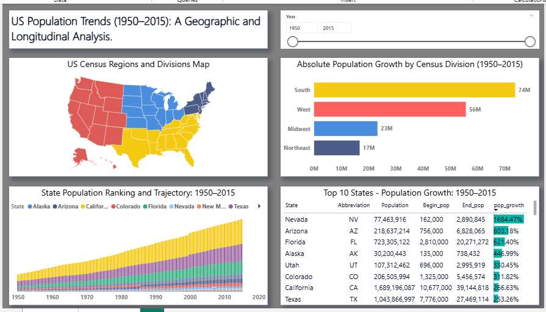
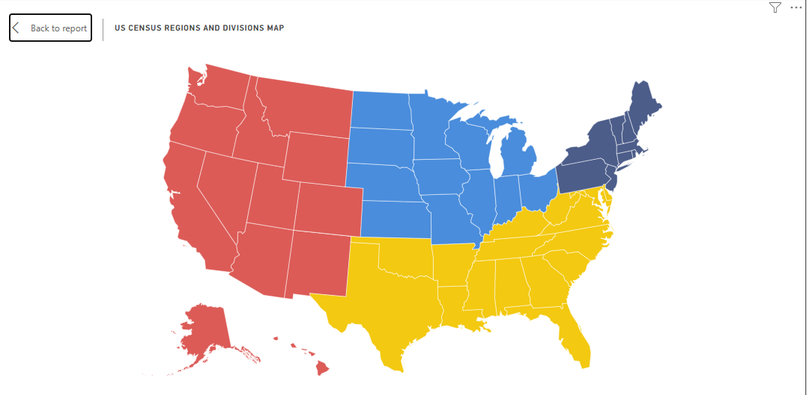
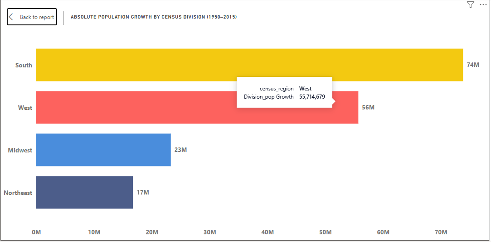
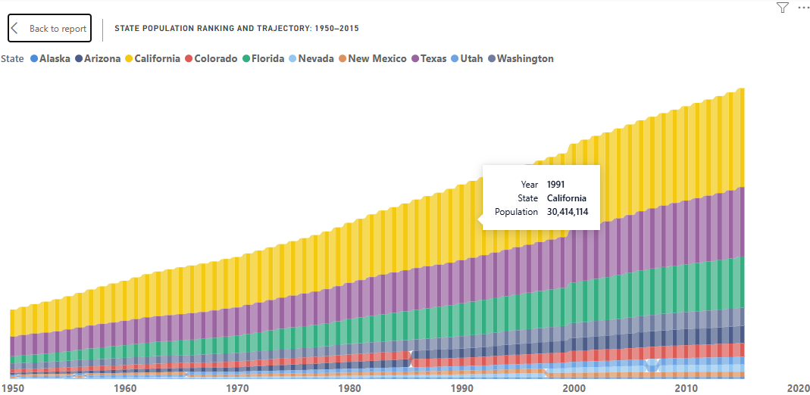
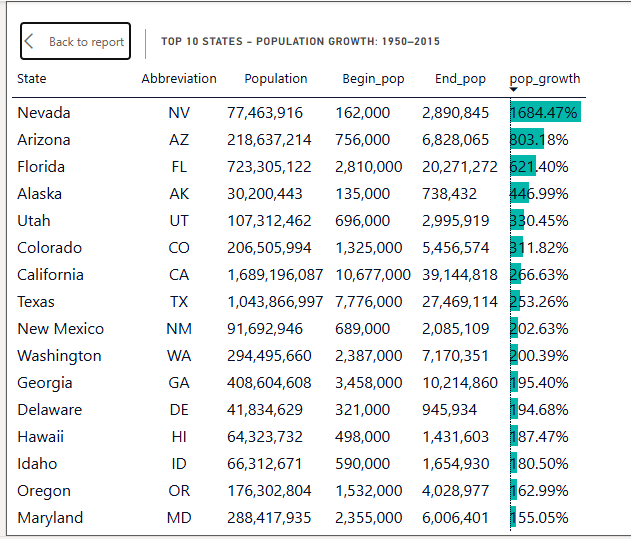
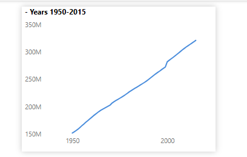

# 📊 Power BI Project: US Population Trends (1950–2015) — Geographic & Longitudinal Analysis

---

## 🔺 Executive Summary

This Power BI dashboard explores **long-term US population trends** across states, census divisions, and regions from 1950 to 2015.  
It enables users to understand **population growth patterns, regional rankings, and state-level dynamics** over time, providing insights for demographic analysis, planning, and learning purposes.

---

## 🔹 Key Insights

- **The South is the most populous region** with 74 million, followed by the West (56M), Midwest (23M), and Northeast (17M).  
- **Population growth trajectories vary across states** — ribbon charts highlight shifts in state rankings over 1950–2015.  
- **Individual state growth** can be compared using the table showing beginning population, ending population, and growth.  
- **Interactive filtering by year** allows for dynamic exploration of population changes over time.  
- **Tooltip page enhances trend analysis** by showing year-by-year population evolution for each state.

---

## ⚙️ Project Details

### 📁 Dataset Overview

The dashboard uses two tables:

| Table Name             | Description |
|------------------------|-------------|
| `States`               | Contains state metadata: abbreviation, census region, census division, and state name |
| `States_population`    | Contains population data by state and year (1950–2015) |

### 🛠 Tools & Techniques Used

- **Power BI Desktop**: Data modeling, DAX measures, interactive visuals  
- **Power Query**: Data cleaning, unpivoting, filtering, renaming columns  
- **Data Relationships**:
  - One-to-many join: `States` → `States_population` via `Abbreviation`
- **Custom Measures** (see below) for key metrics and dynamic titles/tooltips  

---

### 🧹 Data Cleaning & Transformation (Power Query Steps)

**States Table:**
- Imported CSV and promoted headers  
- Set data types for all columns  
- Removed irrelevant columns, keeping only `State`, `Abbreviation`, `census_region`, and `census_division`  
- Renamed columns for clarity  

**States_population Table:**
- Imported CSV and promoted headers  
- Converted all columns to integer type  
- Unpivoted state columns into long format (`Year`, `Abbreviation`, `State_population`)  
- Filtered to include years ≥ 1950  
- Renamed columns for clarity  

---

## 🔍 Dashboard Previews

### 📄 Standard Page – Overview
- Full-page screenshot showing all visuals, title, and slicer.  

### 📄 Map Visual – Focus Mode
- Shows states and their census divisions.  

### 📄 Bar Chart – Focus Mode
- Ranks regions by population (South, West, Midwest, Northeast).  

### 📄 Ribbon Chart – Focus Mode
- Shows ranking trajectory of states from 1950–2015.  

### 📄 Table – Focus Mode
- Displays each state’s beginning population, end population, and population growth.  

### 📄 Tooltip Page
- Line graph showing population over years for the selected state.  

---

## 🧮 Key Measures

| Measure                        | Description |
|--------------------------------|-------------|
| `Begin_pop`                     | Population of each state at the first year in the dataset |
| `End_pop`                       | Population of each state at the last year in the dataset |
| `Division_pop Growth`           | Total population growth per census division (sum of states’ growth) |
| `Fastest Growing State KPI`     | Identifies the state with the highest population growth |
| `pop_growth`                     | Calculates population growth rate for each state (% of beginning population) |
| `Population`                     | Total population for current selection (state, division, or region) |
| `Ribbon Chart Guidance Tooltip`  | Provides a tip on interacting with the ribbon chart (Top 10 states) |
| `Table_title`                     | Dynamic table title showing Top 10 states and year range |
| `Tooltip title`                   | Dynamic tooltip title showing state and year range |
| `US Population 2015 KPI`          | Total US population for 2015, ignoring other filters |

---

## 📢 Recommendations / Usage

- Use the **slicer** to analyze population trends for specific years or decades.  
- Explore the **ribbon chart** to identify how state rankings shift over time.  
- Hover over states to see detailed **tooltip trends**, enhancing understanding of longitudinal changes.  
- Utilize the **bar chart and table** to compare regional and state-level growth for demographic or educational analyses.  
- This dashboard is ideal for **learning, trend analysis, and demographic insights**, and can be extended to visualize projections or policy scenarios.

---

## 📂 Files & Visual Assets

- [`README.md`](./README.md) – Project documentation
- [`Us_population_Bi_project.pbix`](./Us_population_Bi_project.pbix) – Power BI report file
- 📸 Report Screenshots:  
  - [Standard Page Overview](./page1_overview.png)  
  - [Map Visual](./map_focus.png)  
  - [Bar Chart](./bar_focus.png)  
  - [Ribbon Chart](./ribbon_focus.png)  
  - [Table](./table_focus.png)  
  - [Tooltip Page](./tooltip_page.png)

